# PosChair V3 System Working Diagram

This document shows the full PosChair V3 system from every user, sensor, software, BLE, firmware, driver, motor, actuator, and feedback input to every output.

## 1. End-to-End System Flow

```mermaid
flowchart LR
  User["User sitting on chair"]
  Camera["Browser camera input"]
  Light["Lighting / camera angle"]
  Browser["Chrome or Edge dashboard"]
  Pose["MediaPipe Pose WASM"]
  Analyzer["Posture Analyzer"]
  Decision["V3 Decision Engine"]
  BLEClient["Web Bluetooth Manager"]
  BLEAir["BLE radio link"]
  ESP32["ESP32-C3 firmware"]
  MotorCtrl["MotorController timed-position model"]
  Drivers["6x BTS7960 H-bridge drivers"]
  Motors["6x DC geared motors"]
  WormRack["6x worm-rack actuators"]
  FoamPads["6x foam pads"]
  Back["User paraspinal muscles"]
  Status["BLE status notify"]
  UI["Dashboard UI"]
  Backend["FastAPI backend"]
  DB["PostgreSQL database"]

  User --> Camera
  Light --> Camera
  Camera --> Browser
  Browser --> Pose
  Pose --> Analyzer
  Analyzer --> Decision
  Decision --> BLEClient
  BLEClient --> BLEAir
  BLEAir --> ESP32
  ESP32 --> MotorCtrl
  MotorCtrl --> Drivers
  Drivers --> Motors
  Motors --> WormRack
  WormRack --> FoamPads
  FoamPads --> Back
  Back --> User

  ESP32 --> Status
  Status --> BLEAir
  BLEAir --> BLEClient
  BLEClient --> UI
  Analyzer --> UI
  Decision --> UI
  UI --> Backend
  Backend --> DB
  DB --> Backend
  Backend --> UI
```

## 2. Inputs and Outputs

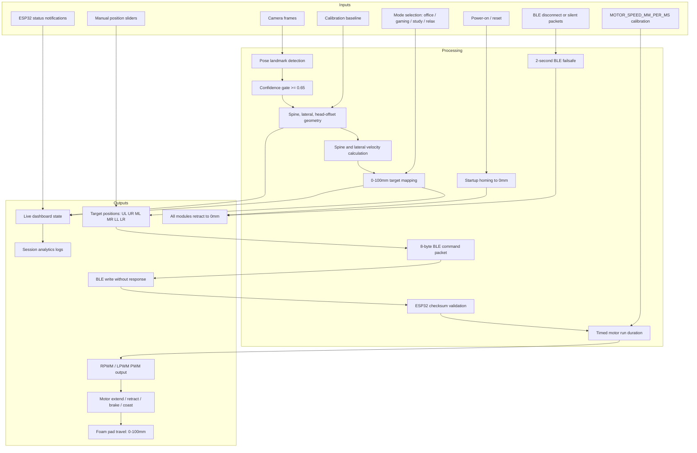

## 3. Browser App Processing Loop

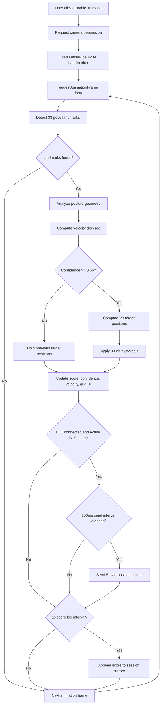

## 4. Decision Engine Mapping

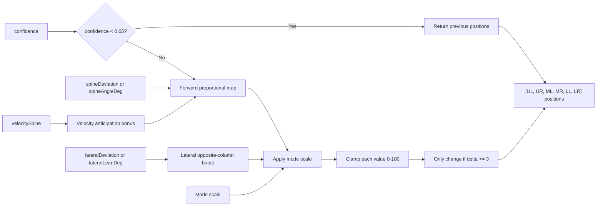

## 5. BLE Packet Path

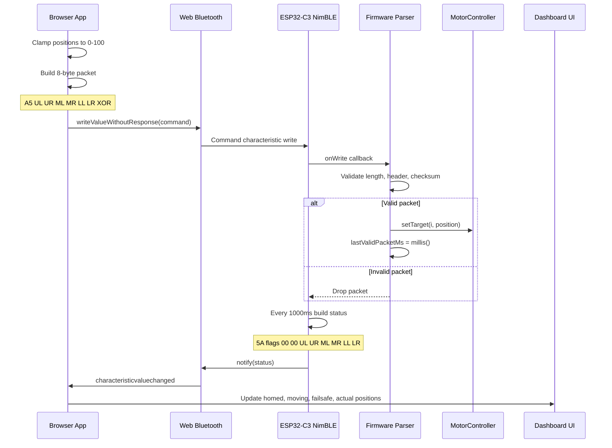

## 6. ESP32 Firmware Loop

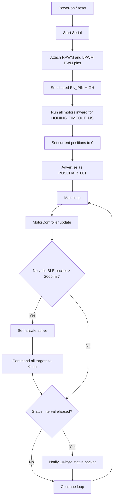

## 7. Single Module Motor Control

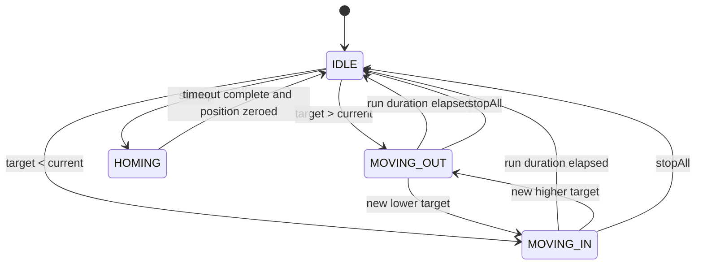

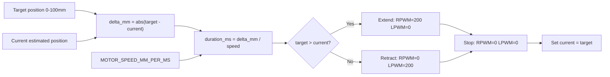

## 8. Physical Output Grid

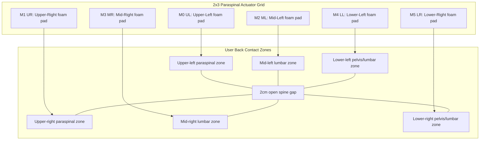

## 9. Safety and Failure Paths

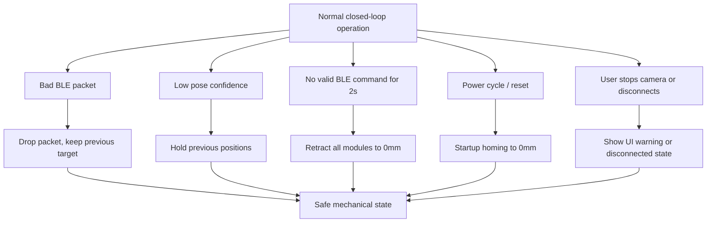

## 10. Backend Data Flow

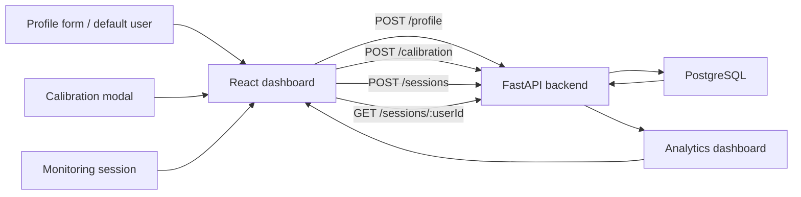

## 11. Key Signals and Units

| Signal | Source | Destination | Unit / Format |
|---|---|---|---|
| Camera frames | Browser camera | MediaPipe Pose | Video frame |
| Pose landmarks | MediaPipe Pose | Posture analyzer | 33 landmarks |
| `spineAngleDeg` | Posture analyzer | Decision engine / UI | Degrees |
| `lateralLeanDeg` | Posture analyzer | Decision engine / UI | Degrees |
| `velocitySpine` | Posture analyzer | Decision engine / UI | Degrees per second |
| `confidence` | Pose landmarks | Decision engine / UI | 0.0-1.0 |
| Target positions | Decision engine | BLE manager | 6 values, 0-100mm |
| Command packet | BLE manager | ESP32-C3 | 8 bytes |
| Current positions | ESP32-C3 | Dashboard UI | 6 values, 0-100mm |
| Motor PWM | ESP32-C3 | BTS7960 drivers | 0-255 duty |
| Foam pad travel | Worm-rack actuator | User back | 0-100mm |
